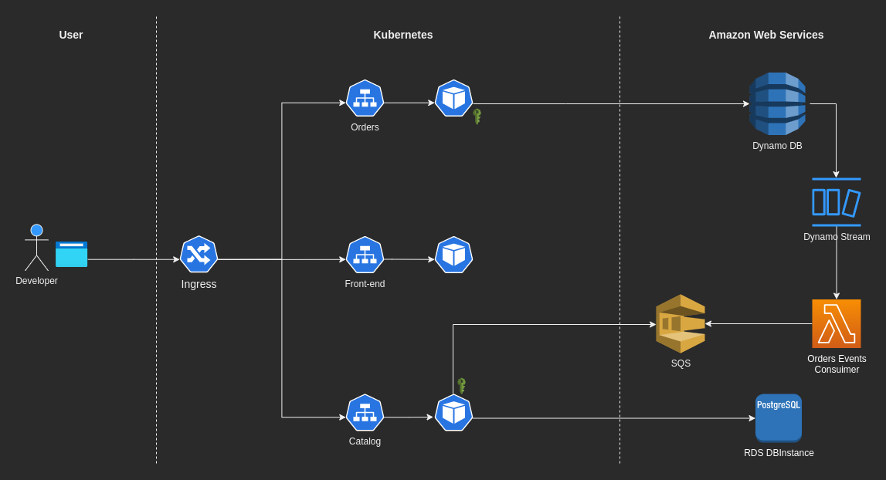

# Prod

The prod environment is already executing the following microservice application

This deployment is relying on Primaza's features, so there is no need of managing Secret data.
It, indeed, is injected at runtime by Primaza.
Developers only needs to claim the required services.

The application is available at [https://primaza-mvp.ngrok.dev/](https://primaza-mvp.ngrok.dev/).
