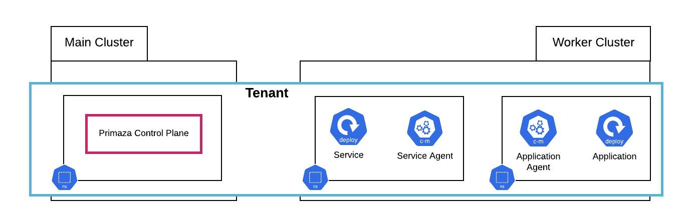

# Tenant

Tenants are isolated spaces that can be spread across multiple clusters.

In each tenant, there is a Namespace in which the Primaza Control Plane is installed.
Optionally, we can have multiple Service Namespaces and Application Namespaces.

The Control Plane manages the Primaza resources in the tenant and keeps Service and Application Namespaces up to date.

Discovery and Binding are delegated to Agents installed respectively in Service and Application Namespaces.

