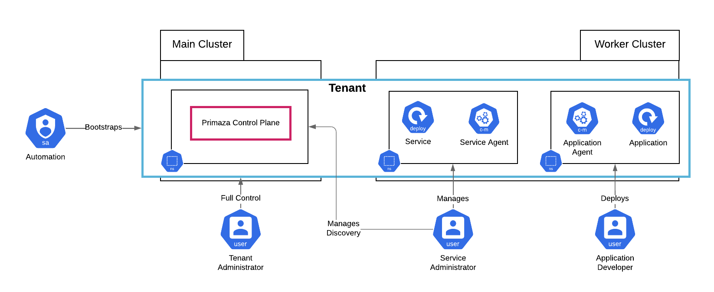

# Personas

TimberFire provides to each customer credentials to work on their Tenant.

More in details, TimeberFire provides by default the following accounts:

- `Tenant Administrator`: has full control over all the Tenant namespaces
- `Service Administrator`:
    - Access to manage Discovery Resources life-cycle in Primaza's Control Plane namespace and Service namespace
    - Access to setting up 3rd-party integration in Primaza's Control Plane
- `Application Developer`: has full control over the Application Namespace
