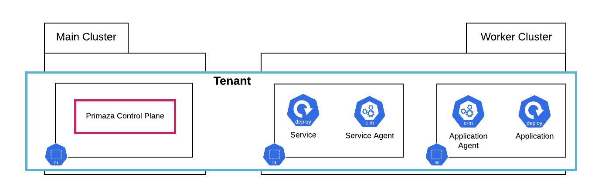

# Tenants

TimberFire creates a Primaza Tenant for each isolated environment a customer asks for.
Two Primaza Tenants would not share information among them.

TimberFire usually configure a Tenant to be spread across two different clusters, called for simplicity `main` and `worker`.

Practically, they provide a default configuration composed by three namespaces:

- `primaza-mytenant` on `main`: where the Primaza's Control Plane is installed
- `services` on `worker`: a (Service) namespace in which Primaza's Service Discovery is configured
- `applications` on `worker`: an (Application) namespace in which Primaza's Binding feature is configured

