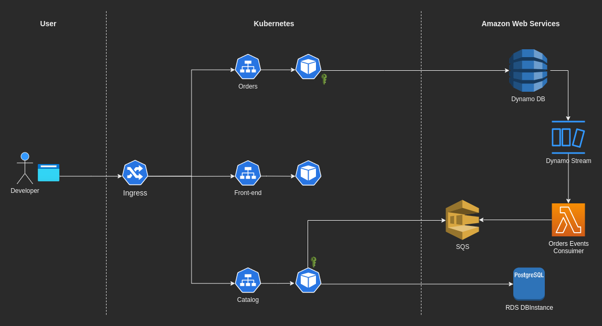

# Inner Loop

Application Developer for `CUSTOMER_NAME` is responsible for the Catalog microservice.
He asks the Tenant Administrator to setup the `demo-app` in their Application Namespace.


## Tenant Administrator

As a Tenant Administrator, we can define tenant-wide claims.

Publish all the microservices but the Order one.


### Tenant wide claims

<!-- Service Binding informations will be pushed to all application namespaces for the given environment -->
Let claim with label selector.

```
Run Demo 5: Claim as A Tenant Administrator
```

Publish the Catalog microservice


### Application Developer: Claim from an Application Namespace

As an Application Developer, we can claim from an Application Namespace.

Let publish our microservice: the Order microservice.
For running it needs a DynamoDB.

```
Run Demo 7: Claim from an application namespace
```


## Application Developer: Publish the demo app




```
Run Demo 8: Publish the demo app
```
