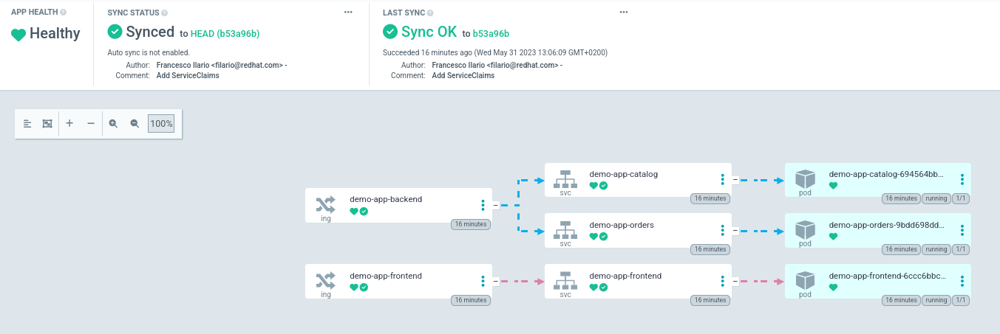

# Application Developer: Publish the application

The *Sapiens* Application Developer is responsible for the whole `demo-app` application.

They use the ArgoCD instance TimberFire is providing by default in the Application Namespace.

Demo Output

