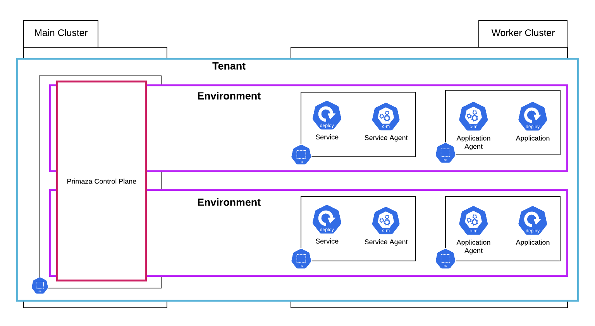

# Environments

In each Tenant can live multiple Environments.
Environments related data are stored in the same Control Plane, so isolation can not be guaranteed.
However, it is very easy and quick to create an Environment and services in the same Tenant can be shared across multiple environments.

This feature can be very valuable for creating short-lived or ephemeral environments for running tests.

An Environment is handled in Primaza as a soft-tag.
To instantiate a connection to a target cluster, you create a ClusterEnvironment resource.
Each ClusterEnvironment has an `environmentName` field.
That's all you need for creating or joining an Environment.

