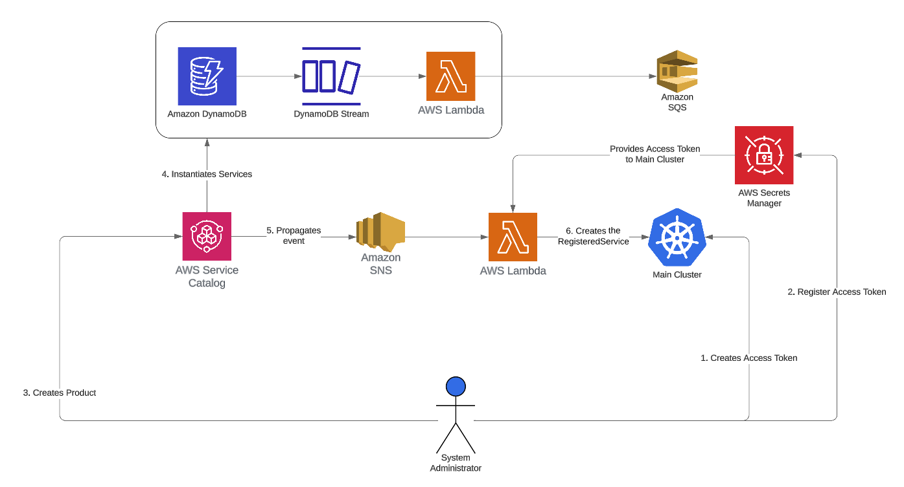

# Service Administrator: 3rd party integration

For the DynamoDB instance as it is a more complex infrastructure the Service Administrator would like to rely on CloudFormation templates and the AWS Service Catalog.
They already has a AWS Service Catalog configured and he created the Product for the DynamoDB, DynamoStreams and Lambda.

Also, they has configured an integration with Primaza.
The integration is make by a Simple Notification Service (SNS) that forwards AWS Service Catalog events to a Lambda function.
The Lambda then uses the event to create a Registered Service into Primaza's Tenant.

