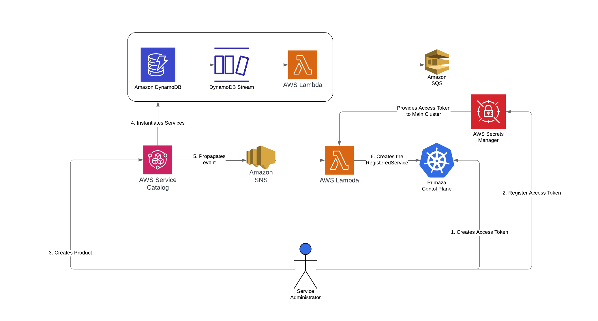

# KaaS Company


## Intro

KaaS company's main business is to provide compute power to developers.
It relies on Kubernetes for orchestrating workloads.
They use Primaza for handling customer tenants and to provide easy service discovery and binding.

A new customer `CUSTOMER_NAME` wants to use their service.
After an account is created a tenant is set up by KaaS company for `CUSTOMER_NAME`.


## Topology and Personas

The KaaS company usually installs tenants across two different clusters:
- `main`: where KaaS installs Primaza Tenants
- `worker`: where KaaS installs Service and Application Namespaces

The KaaS company provides by default the following three namespaces across `main` and `worker` clusters:

- `primaza-mytenant` on `main`: where the Primaza's Control Plane is installed
- `services` on `worker`: a (Service) namespace in which Primaza's Service Discovery is configured
- `applications` on `worker`: an (Application) namespace in which Primaza's Binding feature is configured

They also provides to customer the following accounts:

 <!-- as a Tenant Administrator, create a ServiceClaim in ControlPlane for binding with label (Side-Effect #2) -->
- `Tenant Administrator`: has full control over the Primaza's Control Plane, the Service Namespace, and the Application Namespace
- `Service Administrator`:
    - Access to manage ServiceClasses lifecycle in Primaza's Control Plane namespace and Service Namespace
    - Access to manage RegisteredServices lifecycle in Primaza's Control Plane namespace
    - Access to setting up 3rd-party integration in Primaza's Control Plane
- `Application Developer`: has full control over the Application Namespace


## Primaza Multi Cluster Environment Setup

When a customer is successfully on-boarded, a pipeline is run for creating and setting up their tenant.

Let's see the Pipeline running:

```
Run Demo 0: Multi Cluster environment setup
```


## Discovery


### Tenant Administrator: Manual registration

<!-- TODO: consider to use RDS for manual registration and SQS for discovery -->

Tenant Administrators are in charge of managing the whole tenant and can configure tenant-wide discovery and claiming.

The `CUSTOMER_NAME` Tenant Administrator has been asked to register an already existing service on AWS: an SQS Queue.

```
Run Demo 1: Manual Registration of a Service
```


### Service Administrator: Service Discovery

<!-- TODO: consider to use RDS for manual registration and SQS for discovery -->

Service Administrators are in charge of service provisioning and discovery in Service Namespaces.

In the meantime, the `CUSTOMER_NAME` Service Administrator is asked to provision using ACK an RDS database and discover it.

```
Run Demo 2: Service Discovery
```


### Tenant Administrator/Service Administrator: 3rd party integration


Then the Service Administrator is asked for configuring the Primaza 3rd-party integration with AWS Service Catalog already configured by the team.



The integration mechanism relies on AWS Service Catalog's event published on an SNS topic and processed by a custom Lambda function.
The Lambda function processes the event and creates/updates/deletes the RegisteredService in Primaza Control Plane.

Finally, the Service Administrator is asked to deploy a Product from the AWS Service Catalog.

```
Run Demo 4: Set up the AWS Service Catalog integration
```


### Wrap Up

```
Show the Service Catalog
```


## Claiming

Spin up ArgoCD as an Application Developer and publish the demo-app.


### Outer Loop

Application Developer for `CUSTOMER_NAME` is responsible for the whole `demo-app` application.
They use the ArgoCD instance KaaS is providing by default in the Application Namespace.

```
Open ArgoCD Dashboard and Run Demo
```


### Inner Loop

Application Developer for `CUSTOMER_NAME` is responsible for the Catalog microservice.
He asks the Tenant Administrator to setup the `demo-app` in their Application Namespace.


#### Tenant Administrator

As a Tenant Administrator, we can define tenant-wide claims.

Publish all the microservices but the Order one.


##### Tenant wide claims

<!-- Service Binding informations will be pushed to all application namespaces for the given environment -->
Let claim with label selector.

```
Run Demo 5: Claim as A Tenant Administrator
```

Publish the Catalog microservice


##### Application Developer: Claim from an Application Namespace

As an Application Developer, we can claim from an Application Namespace.

Let publish our microservice: the Order microservice.
For running it needs a DynamoDB.

```
Run Demo 7: Claim from an application namespace
```


## Application Developer: Publish the demo app


```
Run Demo 8: Publish the demo app
```
