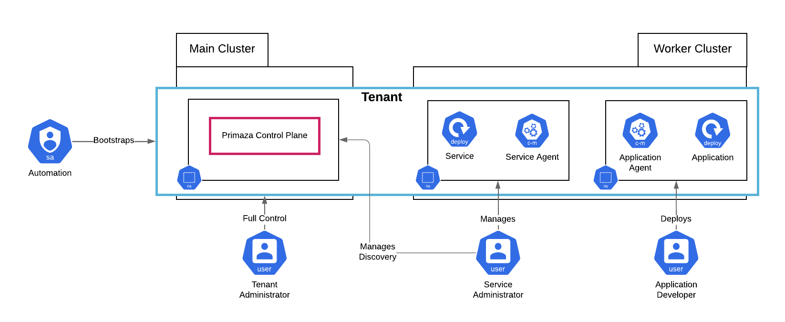

# Primaza Multi Cluster Environment Setup

When *Sapiens* is successfully on-boarded, a pipeline is run for creating and setting up their tenant.

The Automation makes use of [primazactl](https://github.com/primaza/primazactl) for creating the new Tenant.
`primazactl` is a command line tool, developed for making the Tenant management as easy as possible.

Demo Output

<pre><code>❯ ./bin/main --env-setup
Create Multi-Cluster environment with Kind
==========================================

# Create a Primaza Tenant on cluster 'main' [1/4]:

> ./bin/primazactl create tenant primaza-mytenant --version latest --context kind-main
Primaza main installed

# Join a worker cluster to Tenant 'primaza-mytenant' [2/4]:

> ./bin/primazactl join cluster  \
    --version latest \
    --tenant primaza-mytenant \
    --cluster-environment worker \
    --environment demo \
    --context kind-worker \
    --tenant-context kind-main
Install and configure worker completed

# Create an Application Namespace on joined cluster 'worker' [3/4]:

> ./bin/primazactl create application-namespace applications \
    --version latest \
    --tenant primaza-mytenant \
    --cluster-environment worker \
    --context kind-worker \
    --tenant-context kind-main
application namespace primaza-application was successfully created

# Create a Service Namespace on joined cluster 'worker' [4/4]:

> ./bin/primazactl create service-namespace services \
    --version latest \
    --tenant primaza-mytenant \
    --cluster-environment worker \
    --context kind-worker \
    --tenant-context kind-main
service namespace primaza-service was successfully created
</pre></code>

As a result, among the other resources, the following deployment are created:

<pre><code>> kubectl get deployment --context kind-main --namespace primaza-mytenant
NAME                                         READY   UP-TO-DATE   AVAILABLE   AGE
deployment.apps/primaza-controller-manager   1/1     1            1           18m

❯ kubectl get deployment --context kind-worker --namespace applications
NAME                               READY   UP-TO-DATE   AVAILABLE   AGE
argocd-applicationset-controller   1/1     1            1           18m
argocd-dex-server                  1/1     1            1           18m
argocd-notifications-controller    1/1     1            1           18m
argocd-redis                       1/1     1            1           18m
argocd-repo-server                 1/1     1            1           18m
argocd-server                      1/1     1            1           18m
ingress-nginx-controller           1/1     1            1           18m
primaza-app-agent                  1/1     1            1           9m

❯ kubectl get deployment --context kind-worker --namespace services
NAME                           READY   UP-TO-DATE   AVAILABLE   AGE
ack-sqs-controller-sqs-chart   1/1     1            1           18m
primaza-svc-agent              1/1     1            1           10m
</pre></code>

