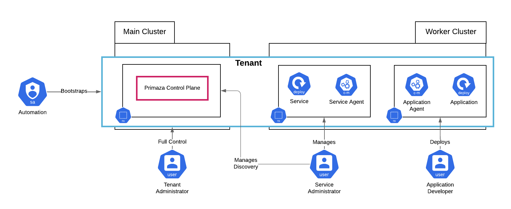

# Topology and Personas

TimberFire creates a Primaza Tenant for each isolated environment a customer asks for.
Two Primaza Tenants would not share information among them.

In each Tenant can live multiple Environments.
Environments related data are stored in the same Control Plane, so isolation can not be guaranteed.
However, it is very easy and quick to create an Environment.
 
More in details, an Environment is handled in Primaza as a soft-tag.
To instantiate a connection to a target cluster, you create a ClusterEnvironment resource.
Each ClusterEnvironment has an `environmentName` field.
That's all you need for creating or joining an Environment.
 
Services in the same Tenant, may be shared across multiple environments.

TimberFire usually configure a Tenant to be spread across two different clusters, called for simplicity `main` and `worker`.

Practically, they provide a default configuration composed by three namespaces:

- `primaza-mytenant` on `main`: where the Primaza's Control Plane is installed
- `services` on `worker`: a (Service) namespace in which Primaza's Service Discovery is configured
- `applications` on `worker`: an (Application) namespace in which Primaza's Binding feature is configured

They also provides to customers the following accounts:

- `Tenant Administrator`: has full control over the Tenant
- `Service Administrator`:
    - Access to manage Discovery Resources life-cycle in Primaza's Control Plane namespace and Service namespace
    - Access to setting up 3rd-party integration in Primaza's Control Plane
- `Application Developer`: has full control over the Application Namespace
